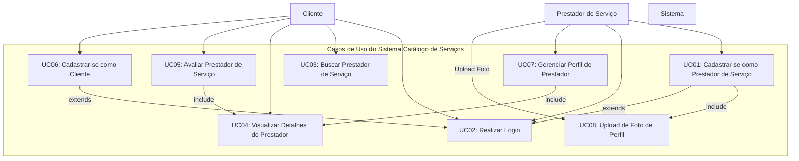
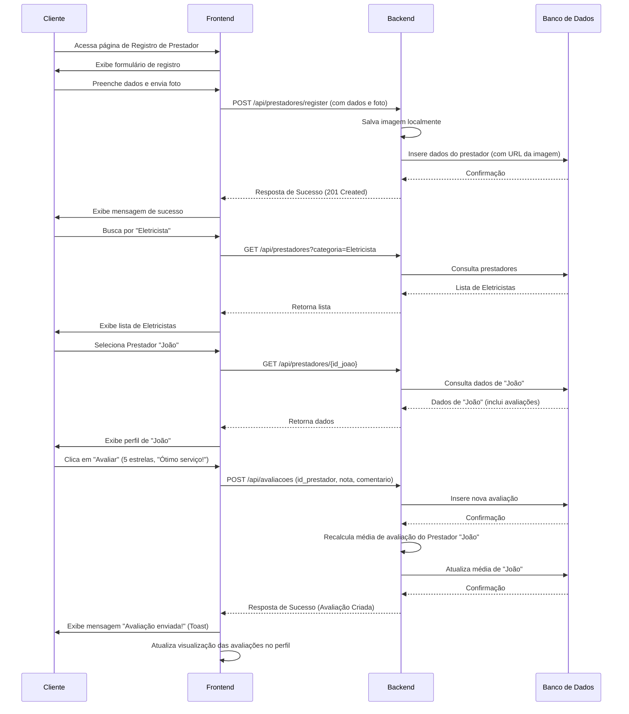

# Documentação Acadêmica do Projeto: Catálogo de Serviços Sustentáveis

## 1. Introdução e Contextualização com o ODS 11

Este projeto foi inspirado pela necessidade de abordar desafios urbanos contemporâneos à luz do **ODS 11 – Cidades e Comunidades Sustentáveis**. O ODS 11 visa tornar as cidades e os assentamentos humanos inclusivos, seguros, resilientes e sustentáveis.

### 1.1. Problema Urbano Identificado

Em muitas cidades, incluindo a nossa, identifica-se uma dificuldade significativa para os cidadãos em **encontrar e contratar prestadores de serviços locais de forma eficiente, confiável e centralizada**. Pequenos empreendedores e trabalhadores autônomos muitas vezes carecem de visibilidade, enquanto os consumidores perdem tempo e recursos buscando por serviços essenciais ou especializados. Essa lacuna pode:

*   Desacelerar a economia local, dificultando a prosperidade de pequenos negócios.
*   Aumentar a informalidade e a precarização do trabalho.
*   Gerar desconfiança devido à falta de referências e avaliações transparentes.
*   Contribuir para deslocamentos desnecessários em busca de serviços que poderiam ser encontrados localmente, impactando a mobilidade e o meio ambiente.

### 1.2. Solução Proposta: Sistema "Catálogo de Serviços"

Para enfrentar esse problema, propomos o desenvolvimento de uma aplicação web, o **"Catálogo de Serviços"**. Esta plataforma digital visa:

*   **Conectar** cidadãos a uma ampla gama de prestadores de serviços em sua localidade.
*   **Facilitar** a busca, o contato e a avaliação desses profissionais.
*   **Promover** a economia local, dando visibilidade e oportunidades para autônomos e pequenas empresas.
*   **Aumentar** a confiança através de um sistema de avaliações e perfis detalhados.

O sistema permite que prestadores de serviços se cadastrem, detalhem suas especialidades, áreas de atuação e informações de contato, incluindo uma foto de perfil. Os usuários (clientes) podem buscar por categorias de serviço, visualizar perfis, e, crucialmente, avaliar os serviços prestados, fomentando um ciclo de feedback e melhoria contínua.

### 1.3. Tecnologias Utilizadas

*   **Front-end:**
    *   **Next.js (React Framework):** Para uma experiência de usuário moderna, rápida e otimizada para SEO.
    *   **TypeScript:** Para adicionar tipagem estática ao JavaScript, aumentando a robustez e a manutenibilidade do código.
    *   **Tailwind CSS:** Para estilização ágil e responsiva, permitindo a criação de interfaces visualmente agradáveis.
    *   **Shadcn/ui:** Biblioteca de componentes UI para agilizar o desenvolvimento.
    *   **Sonner:** Para notificações toast (feedback visual ao usuário).
*   **Back-end:**
    *   **Spring Boot (Java):** Framework robusto e amplamente utilizado para desenvolvimento de APIs RESTful escaláveis e seguras.
    *   **Spring Data JPA:** Para facilitar a persistência de dados e interação com o banco de dados.
    *   **Java 17:** Versão LTS do Java, garantindo performance e segurança.
*   **Banco de Dados:**
    *   **SQLite:** Utilizado para fins de desenvolvimento e prototipagem devido à sua simplicidade e configuração mínima. Em um ambiente de produção, seria recomendável a migração para um SGBD mais robusto como PostgreSQL ou MySQL.
*   **Servidor de Imagens:**
    *   Upload local de imagens para o perfil dos prestadores, com as URLs servidas pela API backend.

### 1.4. Impactos Esperados e Benefícios

A implementação do "Catálogo de Serviços" pode gerar os seguintes impactos positivos, alinhados com as metas do ODS 11:

*   **Impactos Sociais:**
    *   **Inclusão e Coesão Comunitária:** Fortalecimento dos laços comunitários ao facilitar a interação entre moradores e prestadores de serviços locais.
    *   **Acesso Facilitado a Serviços:** Melhoria do acesso a serviços essenciais e especializados para todos os cidadãos.
    *   **Empoderamento de Pequenos Empreendedores:** Criação de um canal de divulgação e captação de clientes para autônomos e microempresas, muitos dos quais podem ser de grupos vulneráveis.
    *   **Transparência e Confiança:** O sistema de avaliação contribui para relações mais transparentes e seguras entre consumidores e prestadores.

*   **Impactos Econômicos:**
    *   **Estímulo à Economia Local:** Direcionamento de gastos para dentro da comunidade, fortalecendo o comércio e os serviços locais.
    *   **Geração de Renda e Emprego:** Criação de novas oportunidades de trabalho e aumento da renda para os prestadores de serviços cadastrados.
    *   **Formalização (Potencial):** A plataforma pode incentivar a formalização de prestadores de serviço ao oferecer um ambiente mais profissional.
    *   **Redução de Custos de Transação:** Diminuição do tempo e esforço para encontrar e contratar serviços.

*   **Impactos Ambientais:**
    *   **Redução de Deslocamentos:** Ao facilitar a contratação de serviços próximos, a plataforma pode contribuir para a diminuição de longos deslocamentos motorizados, reduzindo a emissão de gases de efeito estufa e o congestionamento.
    *   **Promoção da Economia Circular:** O catálogo pode destacar serviços de reparo, manutenção e reutilização, incentivando práticas mais sustentáveis e reduzindo o descarte de produtos.

## 2. Proposta de Manutenção Evolutiva

Para futuras versões do sistema "Catálogo de Serviços", propõe-se a implementação da seguinte funcionalidade:

### **Sistema de Agendamento Integrado e Notificações**

**Descrição:**
Atualmente, o sistema permite a visualização de contatos para que o cliente entre em contato com o prestador. Uma evolução significativa seria integrar um sistema de agendamento diretamente na plataforma.

**Funcionalidades Detalhadas:**

1.  **Solicitação de Agendamento:**
    *   O cliente, ao visualizar o perfil de um prestador, poderia verificar sua disponibilidade (calendário simplificado) e solicitar um horário para o serviço.
    *   O cliente poderia incluir uma breve descrição do serviço necessitado na solicitação.

2.  **Gerenciamento de Agenda pelo Prestador:**
    *   Prestadores teriam uma interface para definir seus horários de trabalho, bloquear datas/horas específicas e visualizar as solicitações de agendamento.
    *   Poderiam aceitar, recusar ou sugerir novos horários para as solicitações.

3.  **Notificações em Tempo Real:**
    *   Tanto clientes quanto prestadores receberiam notificações (na plataforma e, opcionalmente, por e-mail/SMS) sobre:
        *   Novas solicitações de agendamento.
        *   Confirmações ou recusas de agendamento.
        *   Lembretes de agendamentos próximos.
        *   Cancelamentos.

4.  **Histórico de Agendamentos:**
    *   Ambas as partes teriam acesso a um histórico de serviços agendados, realizados ou cancelados.

5.  **(Opcional) Integração com Calendários Externos:**
    *   Possibilidade de sincronização da agenda do prestador com Google Calendar, Outlook Calendar, etc.

**Benefícios da Evolução:**

*   **Conveniência:** Simplifica o processo de contratação, tornando-o mais ágil para ambas as partes.
*   **Organização:** Ajuda os prestadores a gerenciar melhor seu tempo e serviços.
*   **Redução de "No-shows":** Lembretes podem diminuir o número de faltas.
*   **Profissionalização:** Agrega valor à plataforma e aos serviços dos prestadores.
*   **Coleta de Dados:** Permitiria análises sobre demanda de serviços, horários de pico, etc., que podem ser úteis para otimizar a plataforma e para os próprios prestadores.

## 3. Apresentação dos Casos de Uso e Diagramas

Os casos de uso descrevem as interações fundamentais entre os atores (usuários e prestadores) e o sistema "Catálogo de Serviços".

### 3.1. Atores

*   **Cliente:** Usuário que busca, visualiza e avalia prestadores de serviço.
*   **Prestador de Serviço:** Usuário que se cadastra para oferecer seus serviços, gerencia seu perfil e é avaliado.
*   **Sistema:** A plataforma "Catálogo de Serviços".

### 3.2. Diagrama de Casos de Uso Geral

### 3.3. Explicação dos Principais Casos de Uso

1.  **UC01: Cadastrar-se como Prestador de Serviço**
    *   **Ator Principal:** Prestador de Serviço.
    *   **Descrição:** Um indivíduo ou empresa deseja oferecer seus serviços na plataforma. O prestador preenche um formulário com informações pessoais/empresariais, detalhes do serviço (categoria, subcategoria, descrição), informações de contato e realiza o upload de uma foto de perfil.
    *   **Fluxo Básico:**
        1.  O Prestador acessa a página de registro de prestadores.
        2.  Preenche os campos obrigatórios (nome, email, senha, telefone, CPF/CNPJ, categoria, subcategoria, descrição do serviço).
        3.  Faz upload da foto de perfil (ator `Prestador` interage com `UC08: Upload de Foto de Perfil` que é incluído neste caso de uso).
        4.  O Sistema valida os dados.
        5.  O Sistema cria uma nova conta de prestador e armazena as informações.
        6.  O Sistema confirma o cadastro.
    *   **Pós-condição:** O prestador está cadastrado e pode ser encontrado nas buscas. Seu perfil, incluindo a foto, está visível.

2.  **UC02: Realizar Login**
    *   **Atores Principais:** Cliente, Prestador de Serviço.
    *   **Descrição:** Um usuário já cadastrado (Cliente ou Prestador) deseja acessar sua conta na plataforma.
    *   **Fluxo Básico:**
        1.  O Usuário acessa a página de login.
        2.  Informa email e senha.
        3.  O Sistema valida as credenciais.
        4.  O Sistema concede acesso à área restrita correspondente ao tipo de usuário.
    *   **Pós-condição:** O usuário está autenticado e pode acessar funcionalidades específicas de seu perfil.

3.  **UC03: Buscar Prestador de Serviço**
    *   **Ator Principal:** Cliente (e usuários não autenticados).
    *   **Descrição:** Um cliente deseja encontrar prestadores de serviço com base em critérios como categoria, subcategoria ou palavras-chave.
    *   **Fluxo Básico:**
        1.  O Cliente acessa a funcionalidade de busca.
        2.  Informa os critérios de busca (ex: seleciona "Serviços Domésticos" -> "Eletricista").
        3.  O Sistema pesquisa no banco de dados os prestadores que correspondem aos critérios.
        4.  O Sistema exibe uma lista de prestadores encontrados, com informações resumidas (nome, foto, avaliação média, categoria).
    *   **Pós-condição:** O cliente visualiza uma lista de prestadores relevantes.

4.  **UC04: Visualizar Detalhes do Prestador**
    *   **Ator Principal:** Cliente (e usuários não autenticados).
    *   **Descrição:** Após encontrar um prestador na busca (UC03) ou através de um link direto, o cliente deseja ver informações mais detalhadas sobre ele.
    *   **Fluxo Básico:**
        1.  O Cliente seleciona um prestador da lista de resultados ou acessa seu perfil.
        2.  O Sistema recupera e exibe todas as informações do prestador: nome, foto, descrição completa dos serviços, telefone, email, avaliações de outros clientes, média de avaliação.
    *   **Pós-condição:** O cliente tem acesso completo às informações públicas do prestador.

5.  **UC05: Avaliar Prestador de Serviço**
    *   **Ator Principal:** Cliente (autenticado).
    *   **Descrição:** Um cliente que utilizou os serviços de um prestador deseja registrar sua satisfação através de uma nota (1 a 5 estrelas) e, opcionalmente, um comentário.
    *   **Fluxo Básico:**
        1.  O Cliente (logado) acessa o perfil do prestador que deseja avaliar (inclui `UC04: Visualizar Detalhes do Prestador`).
        2.  Seleciona a opção de avaliar.
        3.  Atribui uma nota (estrelas) e escreve um comentário (opcional).
        4.  O Sistema registra a avaliação, associando-a ao prestador e ao cliente.
        5.  O Sistema recalcula a média de avaliação do prestador.
        6.  O Sistema exibe a nova avaliação no perfil do prestador.
    *   **Pós-condição:** A avaliação é registrada e visível. A média do prestador é atualizada.

6.  **UC06: Cadastrar-se como Cliente**
    *   **Ator Principal:** Cliente.
    *   **Descrição:** Um novo usuário deseja criar uma conta de cliente para poder avaliar prestadores e, futuramente, acessar outras funcionalidades restritas.
    *   **Fluxo Básico:**
        1.  O Usuário acessa a página de registro de clientes.
        2.  Preenche os campos obrigatórios (nome, email, senha).
        3.  O Sistema valida os dados.
        4.  O Sistema cria uma nova conta de cliente.
        5.  O Sistema confirma o cadastro.
    *   **Pós-condição:** O cliente está cadastrado e pode realizar login e avaliar prestadores.

7.  **UC07: Gerenciar Perfil de Prestador**
    *   **Ator Principal:** Prestador de Serviço (autenticado).
    *   **Descrição:** Um prestador de serviço deseja atualizar as informações do seu perfil (dados de contato, descrição dos serviços, foto, etc.).
    *   **Fluxo Básico:**
        1.  O Prestador realiza login (UC02).
        2.  Acessa a área de gerenciamento do seu perfil.
        3.  O Sistema exibe as informações atuais do perfil (inclui `UC04: Visualizar Detalhes do Prestador` no sentido de carregar os dados).
        4.  O Prestador edita os campos desejados.
        5.  O Prestador pode optar por atualizar sua foto de perfil (interage com `UC08: Upload de Foto de Perfil`).
        6.  O Sistema valida e salva as alterações.
    *   **Pós-condição:** As informações do perfil do prestador são atualizadas.

8.  **UC08: Upload de Foto de Perfil**
    *   **Ator Principal:** Prestador de Serviço.
    *   **Descrição:** Um prestador de serviço deseja adicionar ou alterar sua foto de perfil. Este caso de uso é geralmente incluído em `UC01: Cadastrar-se como Prestador de Serviço` e `UC07: Gerenciar Perfil de Prestador`.
    *   **Fluxo Básico:**
        1.  O Prestador, durante o cadastro ou edição do perfil, seleciona a opção de upload de foto.
        2.  Escolhe um arquivo de imagem do seu dispositivo.
        3.  O Sistema realiza o upload do arquivo para o servidor.
        4.  O Sistema associa a URL da imagem ao perfil do prestador.
        5.  O Sistema exibe a nova foto no perfil.
    *   **Pós-condição:** A foto de perfil do prestador é atualizada e armazenada no sistema.

### 3.4. Diagrama de Fluxo - Cadastro e Avaliação (Simplificado)

## 4. Link do Código Fonte (GitHub)

O código fonte completo do projeto "Catálogo de Serviços" está disponível no seguinte repositório GitHub:

[https://github.com/seu-usuario/aep-catalogo-servicos](https://github.com/seu-usuario/aep-catalogo-servicos)

**Nota:** Substitua `seu-usuario/aep-catalogo-servicos` pelo link real do seu repositório.

---

Este documento visa atender aos requisitos da atividade, contextualizando o sistema desenvolvido com o ODS 11, propondo uma evolução e detalhando seus casos de uso.
