```mermaid
sequenceDiagram
    participant U as Usuário
    participant F as Frontend
    participant B as Backend
    participant D as Database
    
    U->>F: Acessa /register
    F->>U: Exibe formulário
    U->>F: Preenche dados + foto
    F->>B: POST /api/files/upload
    B->>F: Retorna URL da foto
    F->>B: POST /api/register
    B->>D: Cria User + Prestador
    D->>B: Confirma criação
    B->>F: Sucesso
    F->>U: Redireciona para /login
```

```mermaid
sequenceDiagram
    participant U as Usuário
    participant F as Frontend
    participant B as Backend
    participant D as Database
    
    U->>F: Acessa homepage
    F->>B: GET /api/prestadores
    B->>D: Query prestadores
    D->>B: Lista prestadores
    B->>F: JSON response
    F->>U: Exibe cards
    
    U->>F: Aplica filtro categoria
    F->>B: GET /api/prestadores?categoria=X
    B->>D: Query filtrada
    D->>B: Lista filtrada
    B->>F: JSON response
    F->>U: Atualiza lista
```

# AEP Catálogo de Serviços

Sistema completo de catálogo de prestadores de serviços desenvolvido com **Next.js 15** (frontend) e **Spring Boot 2.7** (backend). O sistema permite o cadastro, visualização, busca com filtros avançados e avaliação de prestadores de serviços.

## 📋 Índice

- [Visão Geral](#-visão-geral)
- [Tecnologias](#-tecnologias)
- [Arquitetura](#-arquitetura)
- [Funcionalidades](#-funcionalidades)
- [Configuração e Instalação](#-configuração-e-instalação)
- [APIs e Endpoints](#-apis-e-endpoints)
- [Estrutura do Banco de Dados](#-estrutura-do-banco-de-dados)
- [Fluxos Principais](#-fluxos-principais)
- [Exemplos de Uso](#-exemplos-de-uso)
- [Testes](#-testes)
- [Deploy](#-deploy)
- [Troubleshooting](#-troubleshooting)
- [Contribuição](#-contribuição)

## 🎯 Visão Geral

O **AEP Catálogo de Serviços** é uma plataforma completa que conecta prestadores de serviços com clientes. O sistema oferece:

- **Cadastro de Prestadores**: Interface intuitiva para registro com upload de foto
- **Catálogo Interativo**: Visualização em cards responsivos com informações detalhadas
- **Sistema de Busca**: Filtros avançados por categoria, localização, preço e avaliação
- **Avaliações**: Sistema completo de ratings com cálculo automático de médias
- **Upload de Imagens**: Gerenciamento de fotos de perfil dos prestadores

## 🛠 Tecnologias

### Frontend
- **Next.js 15** - Framework React com App Router
- **TypeScript** - Linguagem com tipagem estática
- **Tailwind CSS** - Framework CSS utilitário
- **Radix UI** - Componentes acessíveis
- **Sonner** - Sistema de notificações toast
- **Axios** - Cliente HTTP para APIs
- **React Hook Form** - Gerenciamento de formulários

### Backend
- **Spring Boot 2.7.18** - Framework Java
- **Spring Data JPA** - ORM e acesso a dados
- **H2 Database** - Banco de dados em memória
- **Maven** - Gerenciador de dependências
- **Java 17** - Linguagem de programação

## 🏗 Arquitetura

```
┌─────────────────┐    HTTP/REST    ┌─────────────────┐
│   Frontend      │ ──────────────► │    Backend      │
│   (Next.js)     │                 │  (Spring Boot)  │
│   Port: 3000    │ ◄────────────── │   Port: 3001    │
└─────────────────┘                 └─────────────────┘
                                            │
                                            ▼
                                    ┌─────────────────┐
                                    │   H2 Database   │
                                    │   (In-Memory)   │
                                    └─────────────────┘
```
### Estrutura de Pastas

```
aep-catalogo-servicos/
├── front-end/              # Aplicação Next.js
│   ├── src/
│   │   ├── app/            # App Router do Next.js
│   │   ├── components/     # Componentes reutilizáveis
│   │   ├── lib/            # Utilitários e services
│   │   ├── types/          # Definições TypeScript
│   │   └── hooks/          # Custom hooks
│   └── package.json
├── back-end/               # API Spring Boot
│   ├── src/main/java/com/aep/catalogo/
│   │   ├── controllers/    # Controllers REST
│   │   ├── models/         # Entidades JPA
│   │   ├── repositories/   # Repositórios JPA
│   │   ├── dto/            # Data Transfer Objects
│   │   └── config/         # Configurações
│   ├── uploads/            # Armazenamento de imagens
│   └── pom.xml
└── README.md               # Esta documentação
```

## ✨ Funcionalidades

### 📝 Cadastro de Prestadores
- Formulário completo com validação
- Upload de foto de perfil
- Seleção de categoria e subcategoria
- Configuração de preços e disponibilidade

### 📱 Catálogo Interativo
- Cards responsivos com design moderno
- Badges para categorias
- Exibição de avaliações em tempo real
- Layout adaptável para desktop e mobile

### 🔍 Sistema de Busca
- Filtros por:
  - Categoria e subcategoria
  - Localização (cidade)
  - Faixa de preço
  - Avaliação mínima
  - Disponibilidade

### ⭐ Sistema de Avaliações
- Interface de rating com estrelas
- Comentários opcionais
- Cálculo automático de médias
- Histórico de avaliações por prestador

### 🖼 Upload de Imagens
- Suporte a JPG, PNG, GIF
- Redimensionamento automático
- Armazenamento organizado por UUID
- URLs públicas para acesso

## ⚙️ Configuração e Instalação

### Pré-requisitos
- **Node.js** 18+ e npm/yarn
- **Java** 17+
- **Maven** 3.6+

### 1. Clone o Repositório
```bash
git clone <url-do-repositorio>
cd aep-catalogo-servicos
```

### 2. Configuração do Backend

```bash
cd back-end

# Instalar dependências
mvn clean install

# Executar aplicação
mvn spring-boot:run
```

A API estará disponível em `http://localhost:3001`

### 3. Configuração do Frontend

```bash
cd front-end

# Instalar dependências
npm install

# Executar em modo desenvolvimento
npm run dev
```

A aplicação estará disponível em `http://localhost:3000`

### 4. Variáveis de Ambiente

#### Frontend (.env.local)
```env
NEXT_PUBLIC_API_URL=http://localhost:3001/api
```

#### Backend (application.properties)
```properties
server.port=3001
spring.datasource.url=jdbc:h2:file:./catalogo
spring.h2.console.enabled=true
spring.servlet.multipart.max-file-size=10MB
```

## 📡 APIs e Endpoints

### Prestadores

#### `GET /api/prestadores`
Busca prestadores com filtros opcionais.

**Parâmetros de Query:**
- `categoria` - Filtro por categoria
- `subcategoria` - Filtro por subcategoria  
- `cidade` - Filtro por cidade
- `precoMin` - Preço mínimo
- `precoMax` - Preço máximo
- `avaliacaoMin` - Avaliação mínima
- `disponivel` - Status de disponibilidade

**Exemplo:**
```bash
GET /api/prestadores?categoria=SERVICOS_DOMESTICOS&cidade=São Paulo&precoMin=50
```

#### `GET /api/prestadores/{id}`
Busca prestador por ID.

#### `POST /api/prestadores/register`
Cadastra novo prestador.

**Body:**
```json
{
  "nome": "João Silva",
  "email": "joao@email.com",
  "telefone": "(11) 99999-9999",
  "cidade": "São Paulo",
  "categoria": "SERVICOS_DOMESTICOS",
  "subcategoria": "LIMPEZA",
  "descricao": "Serviços de limpeza residencial",
  "preco": 100.0,
  "disponivel": true,
  "fotoPerfil": "url-da-imagem"
}
```

### Avaliações

#### `POST /api/avaliacoes`
Cria nova avaliação.

**Body:**
```json
{
  "prestadorId": 1,
  "nota": 5,
  "comentario": "Excelente serviço!"
}
```

#### `GET /api/avaliacoes/prestador/{id}`
Lista avaliações de um prestador.

### Upload de Arquivos

#### `POST /api/files/upload`
Faz upload de imagem.

**Form Data:**
- `file` - Arquivo de imagem (JPG, PNG, GIF)

**Resposta:**
```json
{
  "filename": "uuid-do-arquivo.jpg",
  "url": "http://localhost:3001/uploads/images/uuid-do-arquivo.jpg"
}
```

## 🗄 Estrutura do Banco de Dados

### Tabela: PRESTADOR
```sql
CREATE TABLE PRESTADOR (
    id BIGINT PRIMARY KEY AUTO_INCREMENT,
    nome VARCHAR(255) NOT NULL,
    email VARCHAR(255) UNIQUE NOT NULL,
    telefone VARCHAR(20),
    cidade VARCHAR(100),
    categoria VARCHAR(50),
    subcategoria VARCHAR(50),
    descricao TEXT,
    preco DECIMAL(10,2),
    disponivel BOOLEAN DEFAULT true,
    foto_perfil VARCHAR(500),
    avaliacao_media DECIMAL(3,2) DEFAULT 0.0,
    total_avaliacoes INTEGER DEFAULT 0,
    data_cadastro TIMESTAMP DEFAULT CURRENT_TIMESTAMP
);
```

### Tabela: AVALIACAO
```sql
CREATE TABLE AVALIACAO (
    id BIGINT PRIMARY KEY AUTO_INCREMENT,
    prestador_id BIGINT NOT NULL,
    nota INTEGER NOT NULL CHECK (nota >= 1 AND nota <= 5),
    comentario TEXT,
    data_avaliacao TIMESTAMP DEFAULT CURRENT_TIMESTAMP,
    FOREIGN KEY (prestador_id) REFERENCES PRESTADOR(id)
);
```

### Enums

#### CategoriaPrestador
- `SERVICOS_DOMESTICOS` - Serviços Domésticos
- `MANUTENCAO_REPAROS` - Manutenção e Reparos
- `BELEZA_BEM_ESTAR` - Beleza e Bem-estar
- `EVENTOS_ENTRETENIMENTO` - Eventos e Entretenimento
- `CONSULTORIA_EDUCACAO` - Consultoria e Educação

#### SubcategoriaPrestador
- `LIMPEZA` - Limpeza
- `JARDINAGEM` - Jardinagem
- `COZINHA` - Cozinha
- `ELETRICA` - Elétrica
- `HIDRAULICA` - Hidráulica
- `PINTURA` - Pintura
- `CABELO` - Cabelo
- `ESTETICA` - Estética
- `MASSAGEM` - Massagem
- `FESTAS` - Festas
- `MUSICA` - Música
- `FOTOGRAFIA` - Fotografia
- `IDIOMAS` - Idiomas
- `INFORMATICA` - Informática
- `FINANCEIRO` - Financeiro

## 🔄 Fluxos Principais

### 1. Cadastro de Prestador
1. Usuário acessa página de registro
2. Preenche formulário com dados pessoais
3. Seleciona foto de perfil (upload)
4. Define categoria e subcategoria
5. Sistema valida dados e salva
6. Prestador fica disponível no catálogo

### 2. Busca e Filtros
1. Cliente acessa página principal
2. Visualiza cards de prestadores
3. Aplica filtros desejados
4. Sistema retorna resultados filtrados
5. Cliente pode ver detalhes e avaliar

### 3. Sistema de Avaliação
1. Cliente seleciona prestador
2. Acessa página de detalhes
3. Dá nota de 1-5 estrelas
4. Opcionalmente escreve comentário
5. Avaliação é salva e média atualizada

## 💡 Exemplos de Uso

### Frontend - Buscar Prestadores
```typescript
import { prestadoresService } from '@/lib/prestadores'

// Busca com filtros
const prestadores = await prestadoresService.buscarPrestadores({
  categoria: 'SERVICOS_DOMESTICOS',
  cidade: 'São Paulo',
  precoMax: 200,
  avaliacaoMin: 4.0
})
```

### Frontend - Avaliar Prestador
```typescript
import { avaliarPrestador } from '@/lib/prestadores'

await avaliarPrestador({
  prestadorId: 1,
  nota: 5,
  comentario: 'Serviço excelente!'
})
```

### Backend - Endpoint Personalizado
```java
@GetMapping("/categoria/{categoria}")
public List<Prestador> getPrestadoresPorCategoria(
    @PathVariable CategoriaPrestador categoria
) {
    return prestadorRepository.findByCategoria(categoria);
}
```

## 🧪 Testes

### Testes de API com curl

#### Criar Prestador
```bash
curl -X POST http://localhost:3001/api/prestadores/register \
  -H "Content-Type: application/json" \
  -d '{
    "nome": "Maria Santos",
    "email": "maria@email.com",
    "telefone": "(11) 88888-8888",
    "cidade": "São Paulo",
    "categoria": "BELEZA_BEM_ESTAR",
    "subcategoria": "CABELO",
    "descricao": "Cabeleireira profissional",
    "preco": 80.0,
    "disponivel": true
  }'
```

#### Buscar Prestadores
```bash
curl "http://localhost:3001/api/prestadores?categoria=BELEZA_BEM_ESTAR&cidade=São%20Paulo"
```

#### Criar Avaliação
```bash
curl -X POST http://localhost:3001/api/avaliacoes \
  -H "Content-Type: application/json" \
  -d '{
    "prestadorId": 1,
    "nota": 5,
    "comentario": "Trabalho impecável!"
  }'
```

#### Upload de Imagem
```bash
curl -X POST http://localhost:3001/api/files/upload \
  -F "file=@/caminho/para/imagem.jpg"
```

### Testes Frontend
```bash
cd front-end
npm run test        # Executar testes
npm run test:watch  # Testes em modo watch
```

### Testes Backend
```bash
cd back-end
mvn test           # Executar testes unitários
mvn verify         # Testes de integração
```

## 🚀 Deploy

### Frontend (Vercel)
```bash
# Build da aplicação
npm run build

# Deploy
vercel --prod
```

### Backend (Heroku)
```bash
# Adicionar Heroku remote
heroku git:remote -a seu-app-name

# Deploy
git push heroku main
```

### Docker
```dockerfile
# Dockerfile - Backend
FROM openjdk:17-jdk-slim
COPY target/*.jar app.jar
EXPOSE 3001
ENTRYPOINT ["java","-jar","/app.jar"]
```

```dockerfile
# Dockerfile - Frontend
FROM node:18-alpine
WORKDIR /app
COPY package*.json ./
RUN npm ci --only=production
COPY . .
RUN npm run build
EXPOSE 3000
CMD ["npm", "start"]
```

## 🔧 Troubleshooting

### Problemas Comuns

#### 1. Erro de CORS
**Problema:** Frontend não consegue acessar backend
**Solução:** Verificar configuração CORS no `CorsConfig.java`

#### 2. Upload de Arquivo Falha
**Problema:** Erro ao fazer upload de imagens
**Solução:** 
- Verificar tamanho do arquivo (max 10MB)
- Verificar formato (JPG, PNG, GIF)
- Verificar permissões da pasta `/uploads`

#### 3. Banco de Dados não Inicializa
**Problema:** H2 Database não carrega
**Solução:**
- Verificar arquivo `application.properties`
- Limpar pasta `target/`
- Executar `mvn clean install`

#### 4. Porta já em Uso
**Problema:** `Port 3000/3001 is already in use`
**Solução:**
```bash
# Verificar processos
lsof -ti:3000
lsof -ti:3001

# Parar processos
kill -9 <PID>
```

#### 5. Dependências Desatualizadas
**Problema:** Conflitos de versão
**Solução:**
```bash
# Frontend
npm audit fix
npm update

# Backend
mvn dependency:tree
mvn versions:use-latest-versions
```

### Logs e Debug

#### Frontend
```bash
# Logs detalhados
DEBUG=* npm run dev

# Console do navegador
# F12 > Console > Network
```

#### Backend
```properties
# application.properties
logging.level.com.aep.catalogo=DEBUG
logging.level.org.springframework.web=DEBUG
spring.jpa.show-sql=true
```

#### Database Console
```
# Acesse: http://localhost:3001/h2-console
JDBC URL: jdbc:h2:file:./catalogo
User Name: sa
Password: (vazio)
```

## 🤝 Contribuição

### Como Contribuir

1. **Fork** o repositório
2. Crie uma **branch** para sua feature (`git checkout -b feature/AmazingFeature`)
3. **Commit** suas mudanças (`git commit -m 'Add some AmazingFeature'`)
4. **Push** para a branch (`git push origin feature/AmazingFeature`)
5. Abra um **Pull Request**

### Padrões de Código

#### Frontend
```typescript
// Usar TypeScript estrito
// Componentes funcionais com hooks
// Nomes em PascalCase para componentes
// Nomes em camelCase para funções/variáveis

interface PrestadorProps {
  prestador: Prestador
  onAvaliar: (nota: number) => void
}

export function PrestadorCard({ prestador, onAvaliar }: PrestadorProps) {
  // Component logic
}
```

#### Backend
```java
// Seguir convenções Spring Boot
// Usar anotações apropriadas
// Nomes descritivos para métodos
// Tratamento adequado de exceções

@RestController
@RequestMapping("/api/prestadores")
public class PrestadorController {
    
    @Autowired
    private PrestadorRepository repository;
    
    @GetMapping("/{id}")
    public ResponseEntity<Prestador> buscarPorId(@PathVariable Long id) {
        return repository.findById(id)
            .map(ResponseEntity::ok)
            .orElse(ResponseEntity.notFound().build());
    }
}
```

### Estrutura de Commits
```
feat: adiciona nova funcionalidade
fix: corrige bug
docs: atualiza documentação
style: formatação de código
refactor: refatoração sem mudança de funcionalidade
test: adiciona ou modifica testes
chore: mudanças em build, CI, etc.
```

---

## 📄 Licença

Este projeto está sob a licença MIT. Veja o arquivo `LICENSE` para mais detalhes.

## 👥 Autores

- **Desenvolvedor Principal** - [Seu Nome](https://github.com/seuusuario)

## 🙏 Agradecimentos

- Comunidade Spring Boot
- Equipe Next.js
- Contribuidores do projeto
- Professores e colegas da AEP

---

**Versão:** 1.0.0  
**Última Atualização:** Dezembro 2024

Para mais informações, entre em contato através das issues do GitHub ou pelo email: [seu@email.com]

        text descricao
        string categoria
        string cidade
        string estado
        string endereco
        integer raio_atendimento
        decimal preco_hora
        decimal preco_servico
        boolean disponivel
        decimal avaliacao_media
        integer total_avaliacoes
        string foto_perfil
        datetime criado_em
        datetime atualizado_em
    }
    
    AVALIACAO {
        bigint id PK
        bigint prestador_id FK
        bigint usuario_id FK
        decimal nota
        text comentario
        datetime criado_em
        datetime atualizado_em
    }
    
    SERVICO {
        bigint id PK
        bigint prestador_id FK
        string nome
        text descricao
        decimal preco
    }
    
    USER ||--o{ PRESTADOR : tem
    PRESTADOR ||--o{ AVALIACAO : recebe
    USER ||--o{ AVALIACAO : faz
    PRESTADOR ||--o{ SERVICO : oferece
```

### Tabelas

#### user
- **id** (PK) - Identificador único
- **nome** - Nome completo
- **email** - Email único
- **senha** - Senha criptografada
- **telefone** - Telefone de contato
- **tipo** - PRESTADOR ou CLIENTE
- **ativo** - Status da conta
- **criado_em** - Data de criação
- **atualizado_em** - Data de atualização

#### prestador
- **id** (PK) - Identificador único
- **usuario_id** (FK) - Referência ao usuário
- **categoria** - Categoria principal do serviço
- **subcategorias** - Lista de subcategorias
- **raio_atendimento** - Raio em KM
- **preco_hora** - Valor por hora
- **avaliacao_media** - Média das avaliações
- **total_avaliacoes** - Total de avaliações

#### avaliacao
- **id** (PK) - Identificador único
- **prestador_id** (FK) - Prestador avaliado
- **usuario_id** (FK) - Usuário que avaliou
- **nota** - Nota de 1.0 a 5.0
- **comentario** - Comentário opcional

## 🔄 Fluxos de Negócio

### 1. Cadastro de Prestador



### 2. Busca e Filtros



### 3. Sistema de Avaliação



```mermaid
sequenceDiagram
    participant U as Usuário
    participant F as Frontend
    participant B as Backend
    participant D as Database
    
    U->>F: Acessa perfil prestador
    F->>B: GET /api/prestadores/{id}
    B->>F: Dados do prestador
    
    U->>F: Seleciona estrelas + clica avaliar
    F->>B: POST /api/avaliacoes
    B->>D: Cria avaliação
    B->>D: Atualiza média do prestador
    D->>B: Confirma operações
    B->>F: Sucesso + dados atualizados
    F->>U: Toast + atualiza interface
```

### 4. Upload de Imagens


## 📁 Estrutura do Projeto

```
aep-catalogo-servicos/
├── README.md
├── .gitignore
├── back-end/
│   ├── pom.xml
│   ├── src/main/java/com/aep/catalogo/
│   │   ├── CatalogoApplication.java
│   │   ├── config/
│   │   │   └── CorsConfig.java
│   │   ├── controllers/
│   │   │   ├── AvaliacaoController.java
│   │   │   ├── FileController.java
│   │   │   ├── PrestadorController.java
│   │   │   └── RegisterController.java
│   │   ├── dto/
│   │   │   ├── AvaliacaoDTO.java
│   │   │   └── RegisterDTO.java
│   │   ├── models/
│   │   │   ├── Avaliacao.java
│   │   │   ├── Prestador.java
│   │   │   ├── Servico.java
│   │   │   ├── User.java
│   │   │   └── enums/
│   │   │       ├── CategoriaPrestador.java
│   │   │       ├── SubcategoriaPrestador.java
│   │   │       └── TipoUsuario.java
│   │   └── repositories/
│   │       ├── AvaliacaoRepository.java
│   │       ├── PrestadorRepository.java
│   │       ├── ServicoRepository.java
│   │       └── UserRepository.java
│   ├── src/main/resources/
│   │   └── application.properties
│   ├── uploads/images/
│   └── catalogo.db
└── front-end/
    ├── package.json
    ├── next.config.ts
    ├── tsconfig.json
    ├── tailwind.config.ts
    ├── src/
    │   ├── app/
    │   │   ├── layout.tsx
    │   │   ├── page.tsx
    │   │   ├── globals.css
    │   │   ├── login/page.tsx
    │   │   ├── register/page.tsx
    │   │   └── prestador/[id]/page.tsx
    │   ├── components/
    │   │   ├── layout/
    │   │   │   └── header.tsx
    │   │   ├── ui/ (shadcn components)
    │   │   ├── login-form.tsx
    │   │   └── register-form.tsx
    │   ├── hooks/
    │   │   └── usePrestadores.ts
    │   ├── lib/
    │   │   ├── prestadores.ts
    │   │   └── utils.ts
    │   ├── types/
    │   │   ├── auth.ts
    │   │   ├── prestador.ts
    │   │   └── user.ts
    │   └── assets/
    │       └── short-logo.svg
    └── public/
```

## 🚀 Deploy

### Backend (Spring Boot)

#### Usando JAR
```bash
cd back-end
mvn clean package
java -jar target/catalogo-servicos-1.0-SNAPSHOT.jar
```

#### Docker
```dockerfile
FROM openjdk:21-jdk-slim
COPY target/catalogo-servicos-1.0-SNAPSHOT.jar app.jar
EXPOSE 3001
ENTRYPOINT ["java", "-jar", "/app.jar"]
```

### Frontend (Next.js)

#### Build para Produção
```bash
cd front-end
npm run build
npm start
```

#### Docker
```dockerfile
FROM node:18-alpine
WORKDIR /app
COPY package*.json ./
RUN npm ci --only=production
COPY . .
RUN npm run build
EXPOSE 3000
CMD ["npm", "start"]
```

### Variáveis de Ambiente

#### Backend (.env)
```env
DB_URL=jdbc:sqlite:catalogo.db
UPLOAD_DIR=uploads/images
SERVER_PORT=3001
```

#### Frontend (.env.local)
```env
NEXT_PUBLIC_API_URL=http://localhost:3001/api
```

## 📝 Scripts Úteis

### Backend
```bash
# Executar aplicação
mvn spring-boot:run

# Executar testes
mvn test

# Gerar JAR
mvn clean package

# Limpar target
mvn clean
```

### Frontend
```bash
# Desenvolvimento
npm run dev

# Build produção
npm run build

# Iniciar produção
npm start

# Lint
npm run lint

# Instalar dependência
npm install <package>
```

### Banco de Dados
```bash
# Acessar SQLite
sqlite3 catalogo.db

# Ver tabelas
.tables

# Descrever tabela
.schema prestador

# Exportar dados
.dump > backup.sql
```

## 🔧 Troubleshooting

### Problemas Comuns

#### Backend não inicia
- Verificar se Java 21+ está instalado
- Verificar se porta 3001 está disponível
- Verificar permissões de escrita no diretório

#### Frontend não conecta com Backend
- Verificar se backend está rodando
- Verificar URL da API em `NEXT_PUBLIC_API_URL`
- Verificar CORS no backend

#### Upload de imagens falha
- Verificar permissões do diretório `uploads/images/`
- Verificar tamanho máximo do arquivo (10MB)
- Verificar formatos aceitos (JPG, PNG, GIF)

#### Erro de CORS
- Verificar configuração em `CorsConfig.java`
- Adicionar origem do frontend se necessário

### Logs

#### Backend Logs
```bash
# Ver logs em tempo real
tail -f logs/spring.log

# Buscar por erro específico
grep -i "error" logs/spring.log
```

#### Frontend Logs
```bash
# Logs do servidor Next.js
npm run dev

# Logs do browser (Console do DevTools)
F12 -> Console
```

## 🤝 Contribuição

### Padrões de Código

#### Backend (Java)
- Usar Lombok para reduzir boilerplate
- Seguir convenções Spring Boot
- Documentar APIs com comentários
- Usar DTOs para transferência de dados

#### Frontend (TypeScript)
- Usar TypeScript estritamente tipado
- Componentes funcionais com Hooks
- Usar CSS Modules ou Tailwind
- Implementar tratamento de erro

### Git Workflow

```bash
# Criar branch para feature
git checkout -b feature/nova-funcionalidade

# Commit seguindo padrão
git commit -m "feat: adiciona sistema de notificações"

# Push da branch
git push origin feature/nova-funcionalidade

# Criar Pull Request
```

### Padrões de Commit
- `feat:` Nova funcionalidade
- `fix:` Correção de bug
- `docs:` Atualização de documentação
- `style:` Mudanças de formatação
- `refactor:` Refatoração de código
- `test:` Adição de testes

## 📄 Licença

Este projeto está licenciado sob a MIT License. Veja o arquivo `LICENSE` para mais detalhes.

## 📞 Suporte

Para suporte e dúvidas:
- 📧 Email: suporte@aep-catalogo.com
- 📱 WhatsApp: (11) 99999-9999
- 🐛 Issues: [GitHub Issues](link-para-issues)

---

**Desenvolvido com ❤️ pela equipe AEP**

*Última atualização: 15 de junho de 2025*
